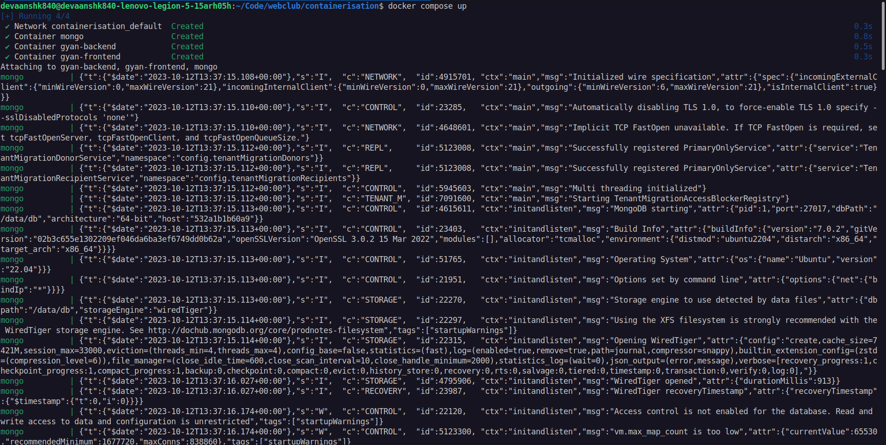
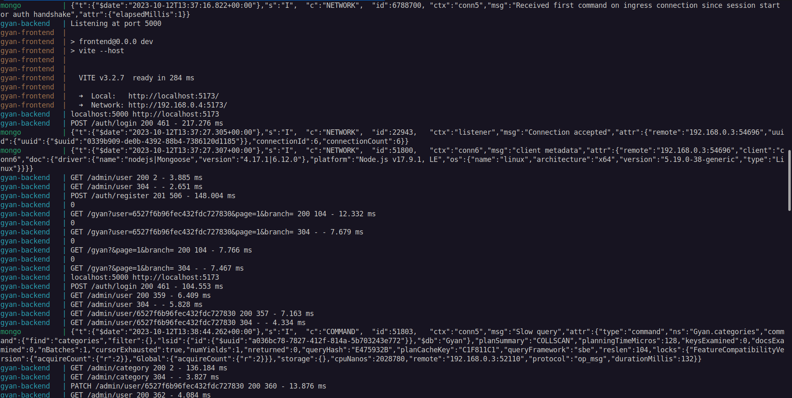
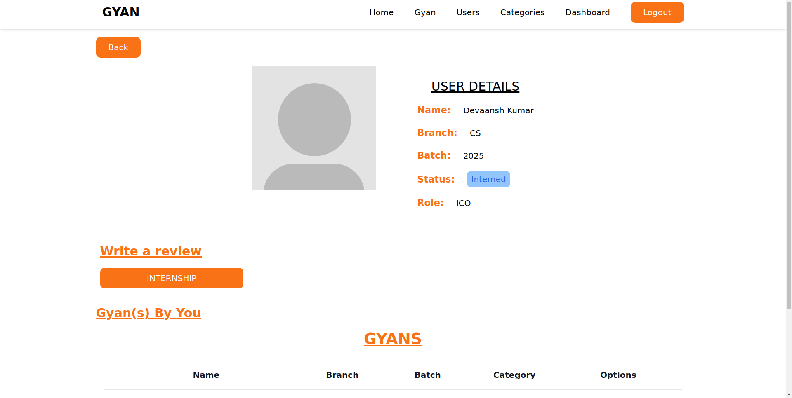

# WebClub Systems and Security Sig Task: Containerisation

## Task 1 and 2

To containerise the given MERN stack application using docker, I first made Docker files for 
the frontend and backend.

This is Dockerfile.frontend
    FROM node:17

    WORKDIR /frontend

    COPY package.json /frontend/
    RUN npm install

    COPY . .

    EXPOSE 5173

    CMD [ "npm", "run", "dev"]

This is Dockerfile.backend.
    FROM node:17

    WORKDIR /app

    COPY package.json /app/
    RUN npm install

    COPY . .

    EXPOSE 5000

    CMD [ "npm", "start" ]

I brought all the services together using docker compose.

```yaml
version: '3'

services:
  mongo:
    image: mongo:latest
    container_name: mongo
    expose:
      - 27017
    volumes:
      - mongo-data:/data/db

  backend:
    build:
      context: .
      dockerfile: Dockerfile.backend
    container_name: gyan-backend
    ports:
      - "5000:5000"
    expose:
      - 5000
    env_file:
      - .env
    depends_on:
      - mongo

  frontend:
    build:
      context: ./frontend
      dockerfile: Dockerfile.frontend
    container_name: gyan-frontend
    ports:
      - "5173:5173"
    depends_on:
      - backend
      - mongo

volumes:
  mongo-data:
```

I am using docker volumes to persist data of MongoDB.

To run the containers just run the following commands:
```bash
docker compose build
docker compose up
```

Now you can visit the site at `http://localhost:5173`

Some screenshots:








