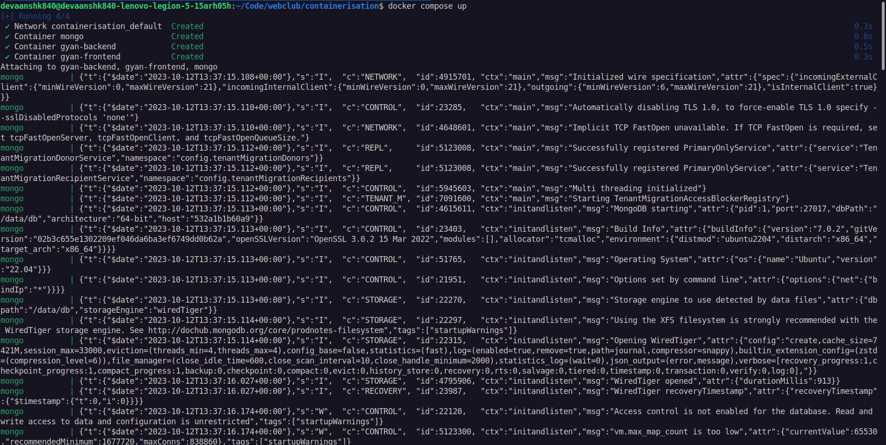
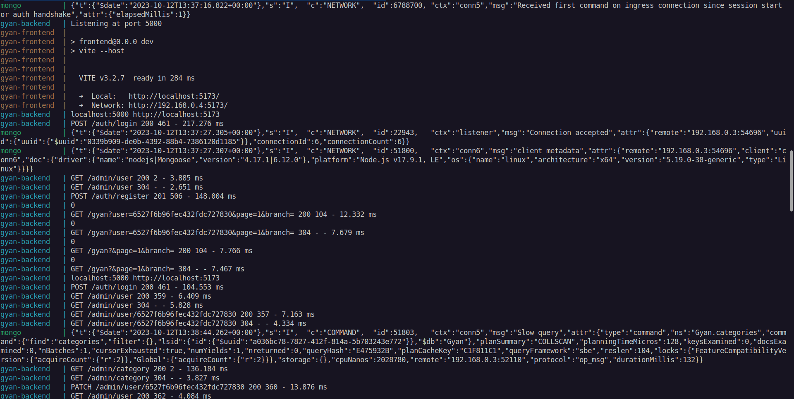
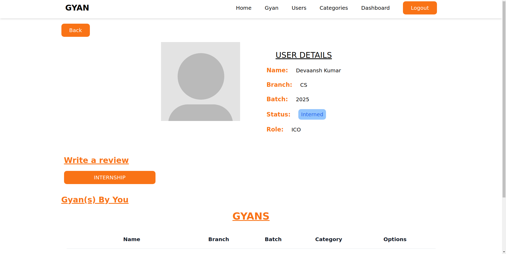
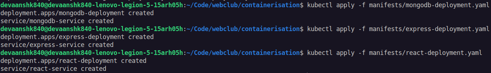
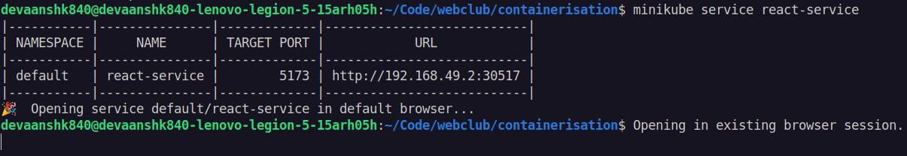
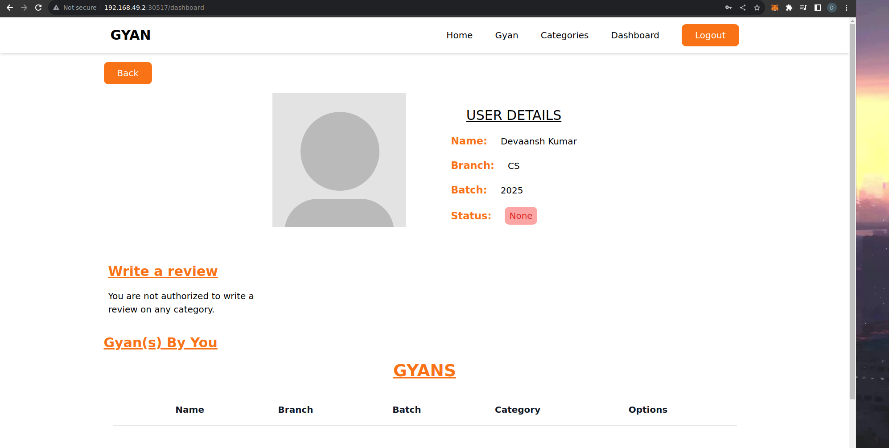
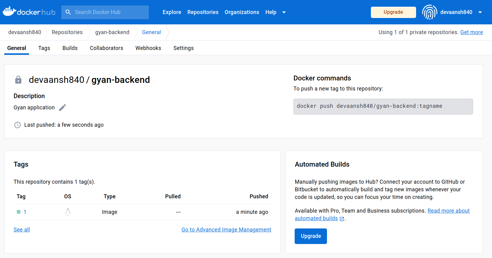
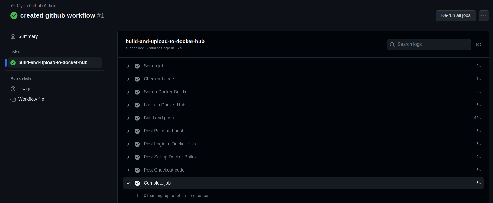

# WebClub Systems and Security Sig Task: Containerisation

## Task 1 and 2: Docker and Docker Compose

To containerise the given MERN stack application using docker, I first made Docker files for 
the frontend and backend.

This is Dockerfile.frontend
```dockerfile
FROM node:17

WORKDIR /frontend

COPY package.json /frontend/
RUN npm install

COPY . .

EXPOSE 5173

CMD [ "npm", "run", "dev"]
```

This is Dockerfile.backend.
```dockerfile
FROM node:17

WORKDIR /app

COPY package.json /app/
RUN npm install

COPY . .

EXPOSE 5000

CMD [ "npm", "start" ]
```

I brought all the services together using docker compose.

```yaml
version: '3'

services:
  mongo:
    image: mongo:latest
    container_name: mongo
    expose:
      - 27017
    volumes:
      - mongo-data:/data/db

  backend:
    build:
      context: .
      dockerfile: Dockerfile.backend
    container_name: gyan-backend
    ports:
      - "5000:5000"
    env_file:
      - .env
    depends_on:
      - mongo

  frontend:
    build:
      context: ./frontend
      dockerfile: Dockerfile.frontend
    container_name: gyan-frontend
    ports:
      - "5173:5173"
    depends_on:
      - backend
      - mongo

volumes:
  mongo-data:
```

I am using docker volumes to persist data of MongoDB.

To run the containers just run the following commands:
```bash
docker compose build
docker compose up
```

Now you can visit the site at `http://localhost:5173`

Some screenshots:







## Task 3: Kubernetes

For deployment of the application on Kuberentes, I have created 3 manifest files, one each for MongoDB, ExpressJS and ReactJS. I have created a deployment object and service object for each.

mongodb-deployment.yaml
```yaml
apiVersion: apps/v1
kind: Deployment
metadata:
  name: mongodb-deployment
  labels:
    app: mongodb-depl
spec:
  selector:
    matchLabels:
      app: mongodb-pod
  template:
    metadata:
      labels:
        app: mongodb-pod
    spec:
      containers:
      - name: mongodb
        image: mongo
        resources:
          limits:
            memory: "128Mi"
            cpu: "500m"
        ports:
        - containerPort: 27017

---

apiVersion: v1
kind: Service
metadata:
  name: mongodb-service
spec:
  selector:
    app: mongodb-pod
  ports:
  - port: 27017
    targetPort: 27017

---
```

express-deployment.yaml
```yaml
apiVersion: apps/v1
kind: Deployment
metadata:
  name: express-deployment
  labels:
    app: express-depl
spec:
  selector:
    matchLabels:
      app: express-pod
  template:
    metadata:
      labels:
        app: express-pod
    spec:
      containers:
      - name: express-container
        image: gyan-backend:latest
        imagePullPolicy: Never
        ports:
        - containerPort: 5000
        env:
          - name: MONGO_URI
            value: mongodb://mongodb-service:27017/Gyan
          - name: PORT
            value: "5000"
          - name: JWT_SECRET
            value: thisisarandomstring

---

apiVersion: v1
kind: Service
metadata:
  name: express-service
spec:
  selector:
    app: express-pod
  type: LoadBalancer
  ports:
  - port: 5000
    targetPort: 5000
    nodePort: 30500

---
```

react-deployment.yaml
```yaml
apiVersion: apps/v1
kind: Deployment
metadata:
  name: react-deployment
  labels:
    app: react-depl
spec:
  selector:
    matchLabels:
      app: react-pod
  template:
    metadata:
      labels:
        app: react-pod
    spec:
      containers:
      - name: react-container
        image: gyan-frontend:latest
        imagePullPolicy: Never
        ports:
        - containerPort: 5173

---

apiVersion: v1
kind: Service
metadata:
  name: react-service
spec:
  selector:
    app: react-pod
  type: LoadBalancer
  ports:
  - port: 5173
    targetPort: 5173
    nodePort: 30517

---
```

First start minikube using the following command. The default driver is docker.
```bash
minikube start
```
After minikube starts get the IP address of minikube and replace `localhost:5000` with `<minikube ip>:30500` everywhere in the react app.
Get the IP using:
```bash
minikube ip
```

To deploy the application, first you need to build the Dockerfiles for the frontend and backend

```bash
docker build -t gyan-backend -f frontend/Dockerfile.backend .
docker build -t gyan-frontend -f frontend/Dockerfile.frontend frontend/
```

The docker images needs to be loading into minikube. The following commands may take some time to finish:
```bash
minikube image load gyan-frontend
minikube image load gyan-backend
```

Once the images are loaded, the manifest files need to be applied in the following order:
```bash
kubectl apply -f manifests/mongodb-deployment.yaml
kubectl apply -f manifests/express-deployment.yaml
kubectl apply -f manifests/react-deployment.yaml
```


After the deployments and services start running, run the following command to automatically start the
```bash
minikube service react-service
```


The application should now start at `<minikube ip>:30517`



After running the application run the following to remove the pods:
```bash
kubectl delete -f manifests/react-deployment.yaml -f manifests/express-deployment.yaml -f manifests/mongodb-deployment.yaml
```

## Bonus Task: Github Action
Create github secrets called `DOCKERHUB_USERNAME` and `DOCKERHUB_PASSWORD` before running the github actions

```yaml
name: Gyan Github Action

on:
  push:
    branches: [ "main" ]
  pull_request:
    branches: [ "main" ]

jobs:
  build-and-upload-to-docker-hub:
    runs-on: ubuntu-latest
    steps:
      - name: Checkout code
        uses: actions/checkout@v3

      - name: Set up Docker Buildx
        uses: docker/setup-buildx-action@v2

      - name: Login to Docker Hub
        uses: docker/login-action@v2
        with:
          username: ${{ secrets.DOCKERHUB_USERNAME }}
          password: ${{ secrets.DOCKERHUB_PASSWORD }}

      - name: Build and push
        uses: docker/build-push-action@v4
        with:
          context: .
          file: ./Dockerfile.backend
          push: true
          tags: ${{ secrets.DOCKERHUB_USERNAME }}/gyan-backend:${{ github.run_number }}
```

I have only deployed the gyan-backend image because only one private image can be uploaded using free account of Docker Hub.



